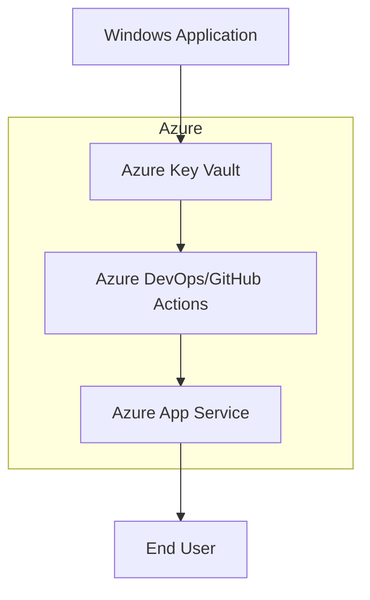

# Secure Code Signing with Azure App Service

## Overview
This sample demonstrates how to securely sign Windows applications deployed via Azure App Service using Azure Key Vault and CI/CD pipelines. It highlights best practices for protecting your application from supply chain vulnerabilities through automated code signing workflows.

## Architecture Diagram


## Prerequisites
- An active Azure subscription
- Azure CLI installed (`az`)
- Azure Developer CLI (`azd`) installed
- GitHub account for CI/CD integration

## Quickstart
1. Clone the repository:
   ```bash
   git clone https://github.com/seligj95/sample-best-practices-ensuring-security-with-azure-app-servi.git
   cd sample-best-practices-ensuring-security-with-azure-app-servi
   ```
2. Initialize and provision Azure resources:
   ```bash
   azd up
   ```
3. Deploy the application:
   ```bash
   azd deploy
   ```
4. Access your deployed application using the URL provided in the output.

## Cost Estimate
| Resource               | Tier       | Estimated Cost |
|------------------------|------------|----------------|
| Azure App Service      | Free       | $0             |
| Azure Key Vault        | Standard   | ~$5/month      |
| Azure DevOps/GitHub    | Free       | $0             |

## Cleanup
To delete all resources created by this sample:
```bash
azd down
```

## Companion Blog Post
Read the full blog post for detailed explanations: [Secure Your Windows Apps with Azure: Code Signing Best Practices](https://example.com/blog/secure-windows-apps-azure-code-signing).