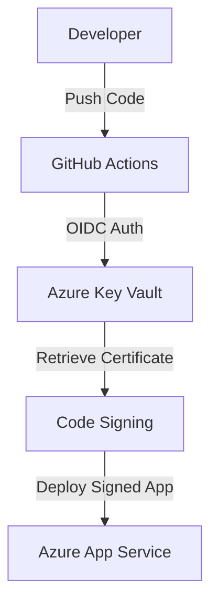

# Secure Code Signing for Windows Apps with Azure App Service

## Overview
This sample demonstrates best practices for securely signing Windows applications deployed via Azure App Service using Azure Key Vault and CI/CD pipelines. It includes infrastructure as code, a sample application, and automated workflows to ensure end-to-end security.

## Architecture


## Prerequisites
- Active Azure subscription
- Azure CLI installed (`az`)
- Node.js and npm installed
- GitHub repository with OIDC authentication configured

## Quickstart
1. Clone this repository:
    ```bash
    git clone https://github.com/seligj95/sample-best-practices-ensuring-security-with-azure-app-servi.git
    cd sample-best-practices-ensuring-security-with-azure-app-servi
    ```
2. Provision resources and deploy the app:
    ```bash
    azd up
    ```
3. Access the deployed app via the URL output by `azd up`.

## Cost Estimate
| Resource             | Tier         | Estimated Cost |
|----------------------|--------------|----------------|
| App Service Plan     | Free         | $0             |
| Azure Key Vault      | Standard     | ~$5/month      |
| GitHub Actions       | Free         | $0             |

## Cleanup
To delete all resources:
```bash
azd down
```

## Companion Blog Post
For detailed explanations and walkthroughs, visit the [blog post](https://github.com/seligj95/seligj95.github.io/pull/4).
