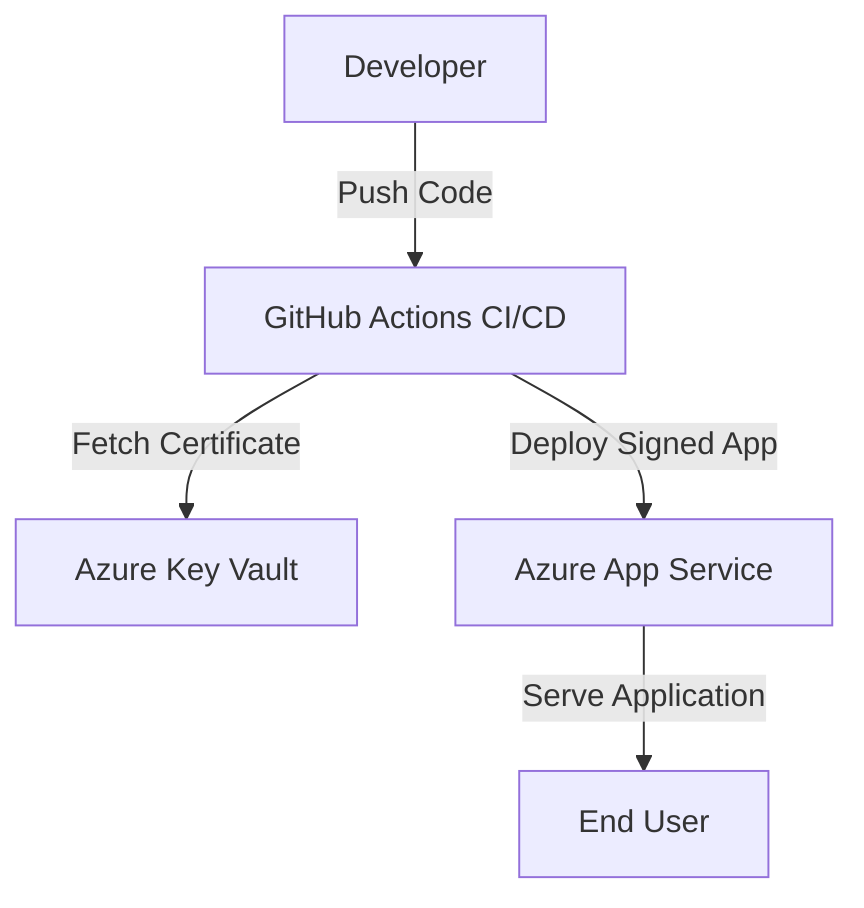

# Secure Windows Apps with Azure: Code Signing Best Practices

## Overview
This sample repository demonstrates secure code signing for Windows applications deployed via Azure App Service. It integrates Azure Key Vault for certificate management and CI/CD pipelines for automated code signing.

## Architecture


## Prerequisites
- Active Azure subscription
- Azure CLI installed (`az`)
- GitHub account
- Node.js installed (v16+ preferred)

## Quickstart
1. Clone this repository:
   ```bash
   git clone https://github.com/your-org/azure-code-signing-demo.git
   cd azure-code-signing-demo
   ```
2. Provision resources and deploy:
   ```bash
   azd up
   ```
3. Access your app at the URL provided by Azure App Service.

## Cost Estimate
| Resource               | Tier        | Estimated Cost |
|------------------------|-------------|----------------|
| Azure App Service Plan | Free        | $0             |
| Azure Key Vault        | Standard    | ~$5/month      |
| GitHub Actions         | Free Tier   | $0             |

## Cleanup
To delete all resources:
```bash
azd down
```

## Companion Blog Post
Read the full blog post [here](https://your-blog-link.com).
