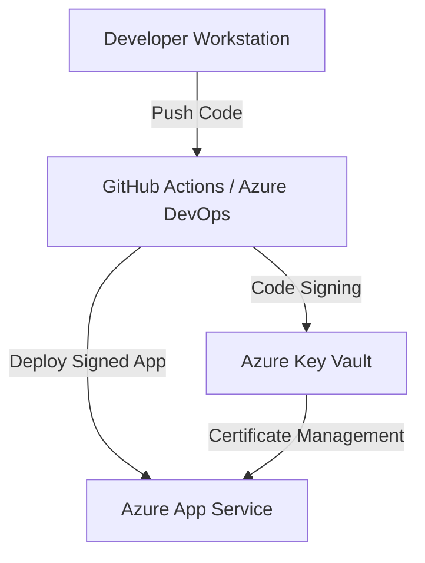

# Secure Your Windows Apps with Azure: Code Signing Best Practices

## Overview
This sample demonstrates how to implement secure code signing for Windows applications deployed via Azure App Service. It integrates Azure Key Vault for certificate management, Azure DevOps or GitHub Actions for CI/CD automation, and Azure App Service for deployment.

## Architecture


## Prerequisites
- Active Azure subscription
- Azure CLI installed
- GitHub account (or Azure DevOps setup)
- Node.js installed

## Quickstart
1. Clone the repository:
   ```bash
   git clone https://github.com/seligj95/sample-best-practices-ensuring-security-with-azure-app-servi.git
   cd sample-best-practices-ensuring-security-with-azure-app-servi
   ```
2. Initialize Azure Developer CLI (azd):
   ```bash
   azd init
   ```
3. Provision resources:
   ```bash
   azd up
   ```
4. Deploy the application:
   ```bash
   azd deploy
   ```
5. Access the deployed app at the URL provided by `azd`.

## Cost Estimate
| Resource              | Tier       | Estimated Cost |
|-----------------------|------------|----------------|
| Azure App Service     | Free/Basic | Free/$5/month  |
| Azure Key Vault       | Standard   | ~$5/month      |
| Azure DevOps/GitHub   | Free       | Free           |

## Cleanup
To delete the resources:
```bash
azd down
```

## Companion Blog Post
Read the full blog post: [Secure Your Windows Apps with Azure: Code Signing Best Practices](https://example.com/blog/secure-windows-apps-azure-code-signing)