# Secure Windows Apps with Azure: Code Signing Best Practices

## Overview
This sample demonstrates how to implement secure code signing for Windows applications deployed via Azure App Service. It includes an automated workflow integrating Azure Key Vault, Azure DevOps, and Azure App Service to ensure your applications are protected from supply chain vulnerabilities.

## Architecture

```mermaid
graph TD
    A[Developer Workstation] -->|Push Code| B[GitHub Repository]
    B -->|Trigger CI/CD Pipeline| C[GitHub Actions Workflow]
    C -->|Access Signing Certificate| D[Azure Key Vault]
    C -->|Deploy Signed App| E[Azure App Service]
    D -->|Securely Stores Certificates| D
    E -->|Runs Signed Windows App| E
```


## Prerequisites
- An active Azure subscription
- Azure CLI installed (`az`)
- Node.js and npm installed
- GitHub account with repository access
- Basic knowledge of Azure App Service and CI/CD pipelines

## Quickstart
1. Clone the repository:
   ```bash
   git clone https://github.com/seligj95/sample-best-practices-ensuring-security-with-azure-app-servi.git
   cd sample-best-practices-ensuring-security-with-azure-app-servi
   ```

2. Initialize the environment and provision resources:
   ```bash
   azd up
   ```

3. Deploy the application:
   ```bash
   azd deploy
   ```

4. Access the deployed application URL:
   ```bash
   azd env get-values --query "APP_SERVICE_URL" --output tsv
   ```

## Cost Estimate
| Resource                 | Tier         | Estimated Cost |
|--------------------------|--------------|----------------|
| Azure App Service Plan   | Free/Basic   | $0-$10/month   |
| Azure Key Vault          | Standard     | ~$5/month      |
| GitHub Actions Workflow  | Free Tier    | $0             |

## Cleanup
To delete all resources created by this sample:
```bash
azd down
```

## Companion Blog Post
Read the full blog post for detailed instructions and explanations: [Secure Your Windows Apps with Azure: Code Signing Best Practices](https://example.com/blog/secure-windows-apps-azure-code-signing)