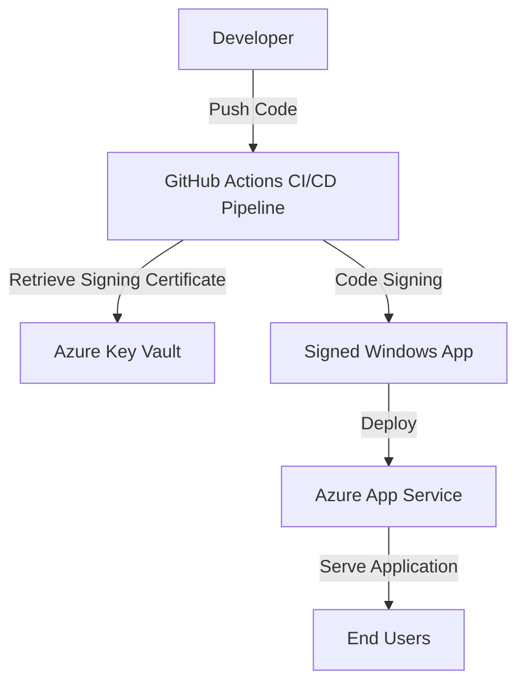

# Secure Windows Apps with Azure: Code Signing Best Practices

## Overview
This sample demonstrates how to implement secure code signing for Windows applications deployed via Azure App Service. It integrates Azure Key Vault, CI/CD pipelines, and Azure App Service to ensure trustworthiness and protect against supply chain vulnerabilities.

## Architecture Diagram


## Prerequisites
- Active Azure subscription
- Azure CLI installed (`az`)
- Node.js installed
- GitHub account for CI/CD integration
- Basic knowledge of Azure App Service and Key Vault

## Quickstart
1. Clone this repository:
   ```bash
   git clone https://github.com/seligj95/sample-best-practices-ensuring-security-with-azure-app-servi.git
   cd sample-best-practices-ensuring-security-with-azure-app-servi
   ```
2. Initialize Azure Developer CLI (AZD):
   ```bash
   azd init -e sample-app -l eastus2
   ```
3. Provision infrastructure:
   ```bash
   azd provision
   ```
4. Deploy the application:
   ```bash
   azd deploy
   ```
5. Access your application via the Azure App Service URL provided by `azd env get-values`.

## Cost Estimate
| Service             | Tier       | Estimated Cost |
|---------------------|------------|----------------|
| Azure App Service   | Free       | $0             |
| Azure Key Vault     | Standard   | ~$5/month      |
| GitHub Actions CI/CD| Free Tier  | $0             |

## Cleanup
To remove all resources and avoid charges, run:
```bash
azd down --purge
```

## Companion Blog Post
Read the full blog post for detailed instructions and insights: [Secure Your Windows Apps with Azure](https://github.com/seligj95/seligj95.github.io/pull/4)