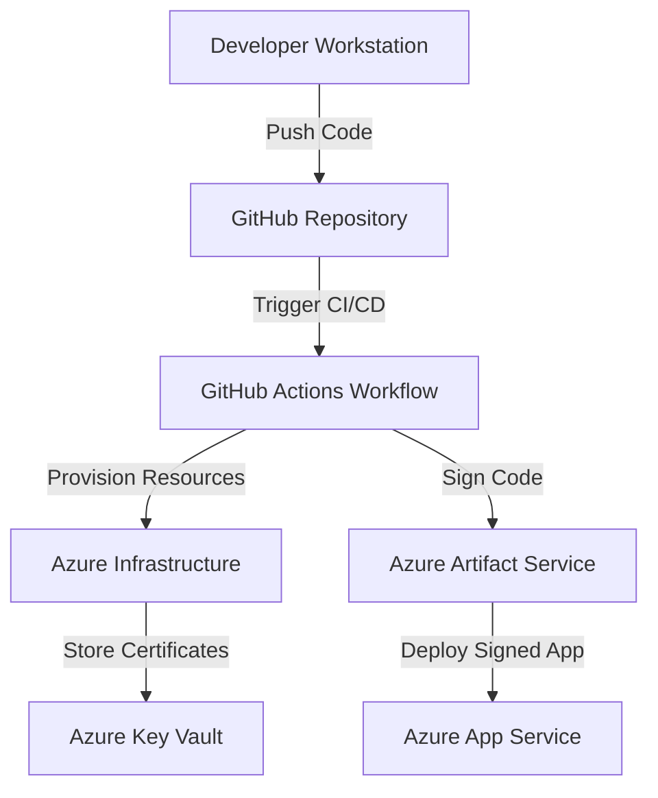

# Secure Windows Apps with Azure: Code Signing Best Practices

## Overview
This sample demonstrates how to implement secure code signing for Windows applications deployed via Azure App Service. It integrates Azure Key Vault, Azure DevOps, and Azure App Service to ensure your app is protected against supply chain vulnerabilities.

## Architecture


## Prerequisites
- Active Azure subscription
- Azure CLI installed (`az`)
- GitHub account
- Node.js and npm installed

## Quickstart
1. Clone the repository:
   ```bash
   git clone https://github.com/seligj95/sample-best-practices-ensuring-security-with-azure-app-servi.git
   cd sample-best-practices-ensuring-security-with-azure-app-servi
   ```

2. Initialize and deploy resources:
   ```bash
   azd up
   ```

3. Access the deployed application:
   ```bash
   azd env get-values
   ```

## Cost Estimate
| Resource         | Tier   | Estimated Cost |
|------------------|--------|----------------|
| Azure App Service| Free   | $0             |
| Azure Key Vault  | Standard| ~$5/month     |

## Cleanup
To remove all deployed resources:
```bash
azd down
```

## Blog Post
Read the companion blog post for detailed information: [Secure Your Windows Apps with Azure](https://example.com/blog-post).